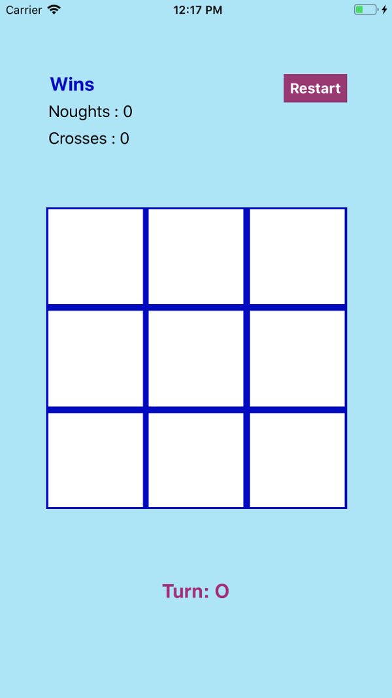
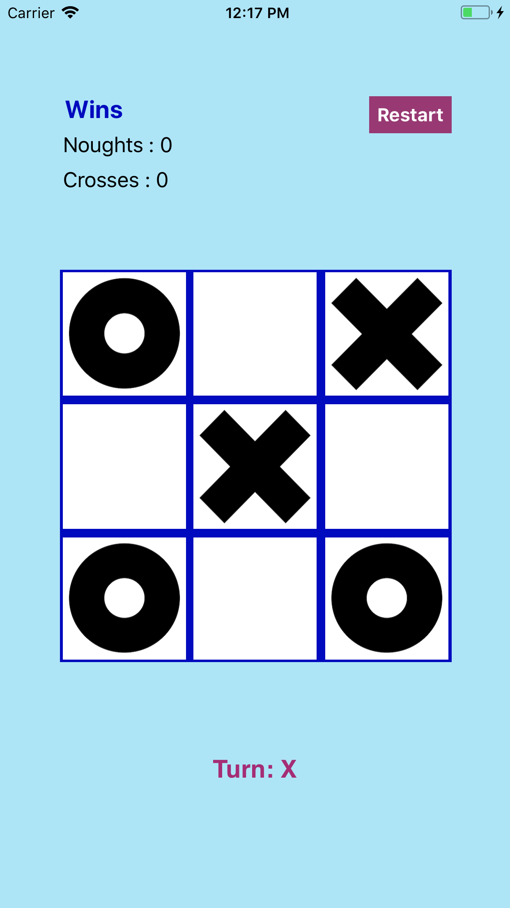

# TicTacToe (iOS)

***

##### This is an iOS version of the popular game [TicTacToe](https://en.wikipedia.org/wiki/Tic-tac-toe) written completely in swift.  The UI uses constraints and currently will work on iPhone 8 and above, and iPads

###### Notes :
- The project is built on Xcode 9.2
- Game rules and information available at the following link : https://en.wikipedia.org/wiki/Tic-tac-toe

#### Screenshots

****

****

****
Available  in the Screenshots folder.

### Todos
- Add AI/Computer module.
- Add support for personal customization for board, noughts and crosses.

